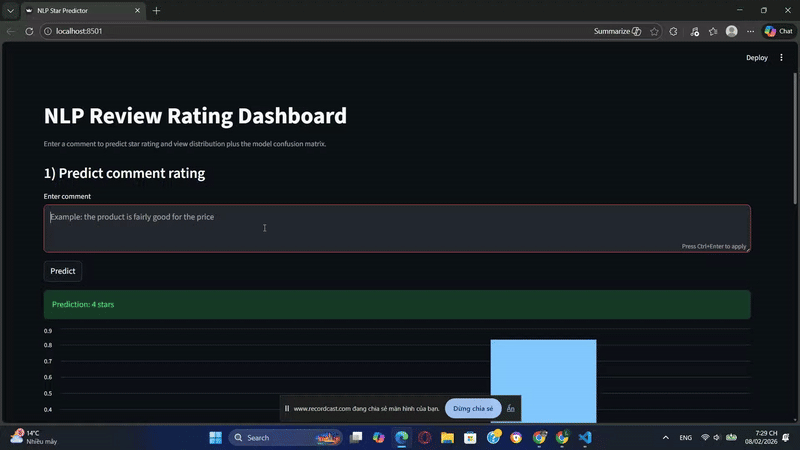

<p align="center">
  
</p>

<p align="center">
  
  
  
  
</p>

<p align="center">
  <b>End-to-end NLP pipeline · Training → Evaluation → Demo</b>
</p>

---
# NLP Review Star Prediction

This project focuses on predicting review star ratings (1–5) from textual reviews using an LSTM-based NLP model.  
The project also includes a Streamlit dashboard for model inference and evaluation.

The goal is to build an end-to-end NLP pipeline, from dataset preparation and model training to deployment-ready demo.


Demo:


Video link:
https://youtu.be/h0ii_3tDnmU

## Features

- Text preprocessing and cleaning
- Tokenization, padding, and embedding
- LSTM model for 5-class star rating classification
- Saving trained model and vectorizer for reuse
- Streamlit dashboard:
  - Predict star rating from input review text
  - Display prediction distribution
  - Show confusion matrix on test data

## Dataset

This project uses a dataset named `review.csv`, which was created and uploaded by the author on Kaggle.

- Task: NLP multi-class classification (1–5 stars)
- Data fields:
  - `comment`: review text
  - `star`: star rating label (1–5)
- The dataset is not committed to GitHub due to its large size

Kaggle dataset link (author-owned):  
https://www.kaggle.com/datasets/longhoangiunqm/data-for-1-to-5-stars-and-comments

After downloading the dataset, place the file at:

data/review.csv

## Project Structure

```text
.
├── src/
│   ├── clean_data.py          # Text cleaning and preprocessing
│   ├── tokenize_data.py       # Tokenization logic
│   ├── padding_data.py        # Sequence padding
│   └── embedding_data.py      # Embedding preparation
│
├── train_model/
│   ├── train_lstm.py          # Training script
│   ├── lstm_model.py          # LSTM model definition
│   └── artifacts/
│       └── dashboard_streamlit.py  # Streamlit dashboard
│
├── data/                      # Dataset (review.csv, not committed)
├── models/                    # Trained model files
├── artifacts/                 # Saved vectorizer and artifacts
├── .gitignore
└── README.md

```
## Requirements

- Python 3.10 or higher (recommended: Python 3.11)
- pip
- Virtual environment (recommended)

## Installation

Clone the repository:

git clone https://github.com/hoanglongvbhp0703-sys/nlp-review-star-prediction.git  
cd nlp-review-star-prediction

Create and activate a virtual environment:

python -m venv .venv

Windows:
.venv\Scripts\activate

Linux / Mac:
source .venv/bin/activate

Install dependencies:

pip install -r requirements.txt

## Training

Make sure the dataset file `data/review.csv` is available.

The training pipeline includes:
1. Text cleaning and preprocessing
2. Tokenization and padding
3. Embedding and LSTM training
4. Model evaluation and artifact saving

Run training:

python train_model/train_lstm.py

After training:
- The trained model is saved in the `models/` directory
- The vectorizer and related artifacts are saved in the `artifacts/` directory
- These files are used directly by the Streamlit dashboard

## Run Dashboard

The dashboard must be run using Streamlit, not directly with Python.

streamlit run train_model/artifacts/dashboard_streamlit.py

Open the local URL printed in the terminal (usually http://localhost:8501).

## Notes

- If model or vectorizer files are missing, run the training script first
- Do not commit virtual environments, cache files, large datasets, or large model files to GitHub
- Git LFS can be used if large model files need to be versioned

## Future Improvements

- Hyperparameter tuning for the LSTM model
- Additional evaluation metrics such as precision, recall, and F1-score per class
- Packaging inference as an API using FastAPI or Flask
- Automated training and evaluation pipeline
- Experimentation with other architectures such as BiLSTM, CNN, or Transformer-based models

## Author

The dataset and the complete NLP pipeline were built by the author to demonstrate an end-to-end workflow, from data creation and model training to evaluation and deployment-ready inference.
